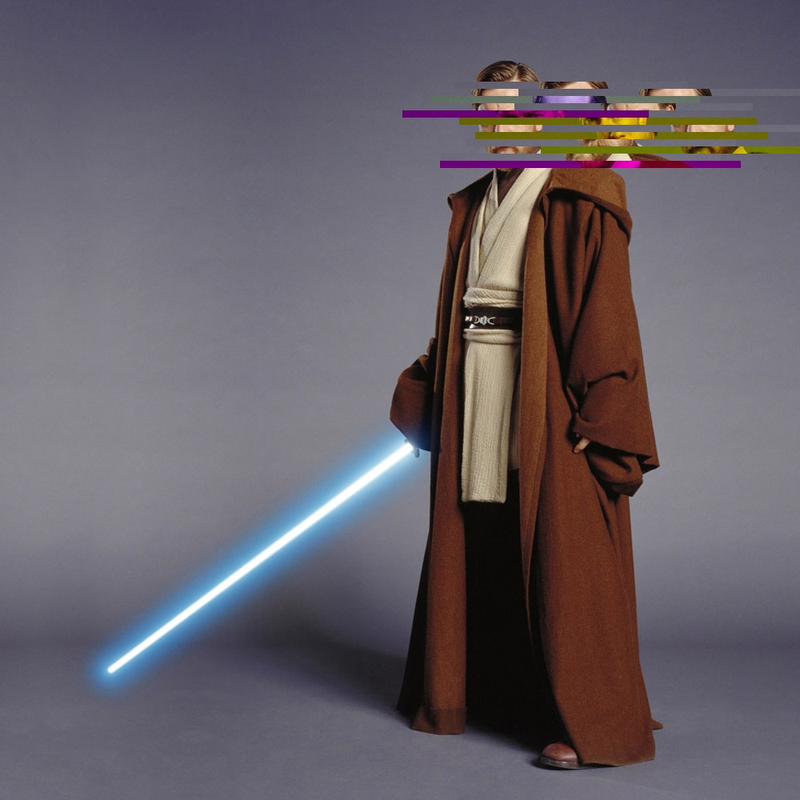
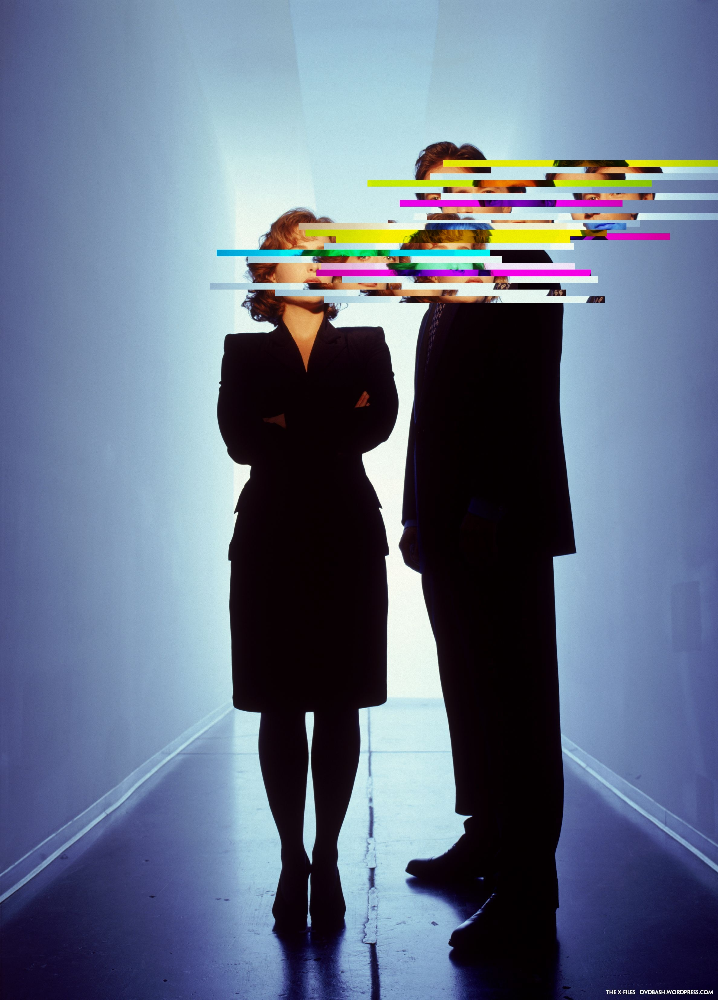

<pre>
 ░▒▓██████▓▒░░▒▓█▓▒░      ░▒▓█▓▒░▒▓████████▓▒░▒▓██████▓▒░░▒▓█▓▒░░▒▓█▓▒░▒▓████████▓▒░▒▓███████▓▒░
░▒▓█▓▒░░▒▓█▓▒░▒▓█▓▒░      ░▒▓█▓▒░  ░▒▓█▓▒░  ░▒▓█▓▒░░▒▓█▓▒░▒▓█▓▒░░▒▓█▓▒░▒▓█▓▒░      ░▒▓█▓▒░░▒▓█▓▒░
░▒▓█▓▒░      ░▒▓█▓▒░      ░▒▓█▓▒░  ░▒▓█▓▒░  ░▒▓█▓▒░      ░▒▓█▓▒░░▒▓█▓▒░▒▓█▓▒░      ░▒▓█▓▒░░▒▓█▓▒░
░▒▓█▓▒▒▓███▓▒░▒▓█▓▒░      ░▒▓█▓▒░  ░▒▓█▓▒░  ░▒▓█▓▒░      ░▒▓████████▓▒░▒▓██████▓▒░ ░▒▓███████▓▒░
░▒▓█▓▒░░▒▓█▓▒░▒▓█▓▒░      ░▒▓█▓▒░  ░▒▓█▓▒░  ░▒▓█▓▒░      ░▒▓█▓▒░░▒▓█▓▒░▒▓█▓▒░      ░▒▓█▓▒░░▒▓█▓▒░
░▒▓█▓▒░░▒▓█▓▒░▒▓█▓▒░      ░▒▓█▓▒░  ░▒▓█▓▒░  ░▒▓█▓▒░░▒▓█▓▒░▒▓█▓▒░░▒▓█▓▒░▒▓█▓▒░      ░▒▓█▓▒░░▒▓█▓▒░
 ░▒▓██████▓▒░░▒▓████████▓▒░▒▓█▓▒░  ░▒▓█▓▒░   ░▒▓██████▓▒░░▒▓█▓▒░░▒▓█▓▒░▒▓████████▓▒░▒▓█▓▒░░▒▓█▓▒░
</pre>

 ----

 # Script to create a glitch effect on faces in images

 ## What is this

 This is just a random script that obscures faces in images.
 It uses a deep nerual network (DNN) with OpenCV to find the faces in images.
 And then some transformations with numpy to "glitch" the image.

 **NOTE** This is **NOT** ment for hiding someones identity, this process are easily reversed

 ### Usage

positional arguments:\
  img_path

options:\
  -h, --help\
  -o, --out\
  -d, --debug

`python3 glitcher.py <filename>`\
`python3 glitcher.py <filename> -o <output file>`

### Requirements

Python3

Python modules Pillow and OpenCV

### Examples

 
 

### TODO

 - Fix so that the glitch effect have a equal spread left to right.
 - Add more lines of glitchyness on top and at the end of the head.
 - Create more effects, insperation: https://tobloef.com/fun/glitch-art
